# Analytics Service

[](https://github.com/abdullahabduljabbarab/analytics-service/actions/workflows/ci.yml)
[](https://github.com/abdullahabduljabbarab/analytics-service/actions/workflows/terraform.yml)
[](LICENSE)

Downstream analytics for the ABS platform. The service consumes the events every other service commits, from the ledger, the orchestrator and the risk engine, keeps a durable analytical copy in **BigQuery `raw_events`**, and serves read-optimized projections derived from it. It owns derived analytical truth, never financial truth: it emits no events, holds no financial credential, and can be stopped or hours behind while payments settle normally (extends ABS-REQ-006). Its engineering thesis, and the flagship proof of this repo, is that the analytical read model is **disposable and rebuildable exactly from the retained event history**. It is deployed on Google Cloud Run, its store is BigQuery reached by IAM rather than a secret, and it ships through a keyless CI pipeline that authenticates with Workload Identity Federation.

It is the fifth service in [ABS Financial Systems](https://github.com/abdullahabduljabbarab/abs-financial-systems): the ledger owns money, the orchestrator owns the payment lifecycle, the risk engine owns decisioning, the notification service owns downstream side effects, and analytics owns projection, replay and the separation of transactional from analytical workloads.

**Live service**

- Interactive API reference (Swagger UI): https://analytics-service-eppidgbmxa-nw.a.run.app/docs
- Health probe: https://analytics-service-eppidgbmxa-nw.a.run.app/health

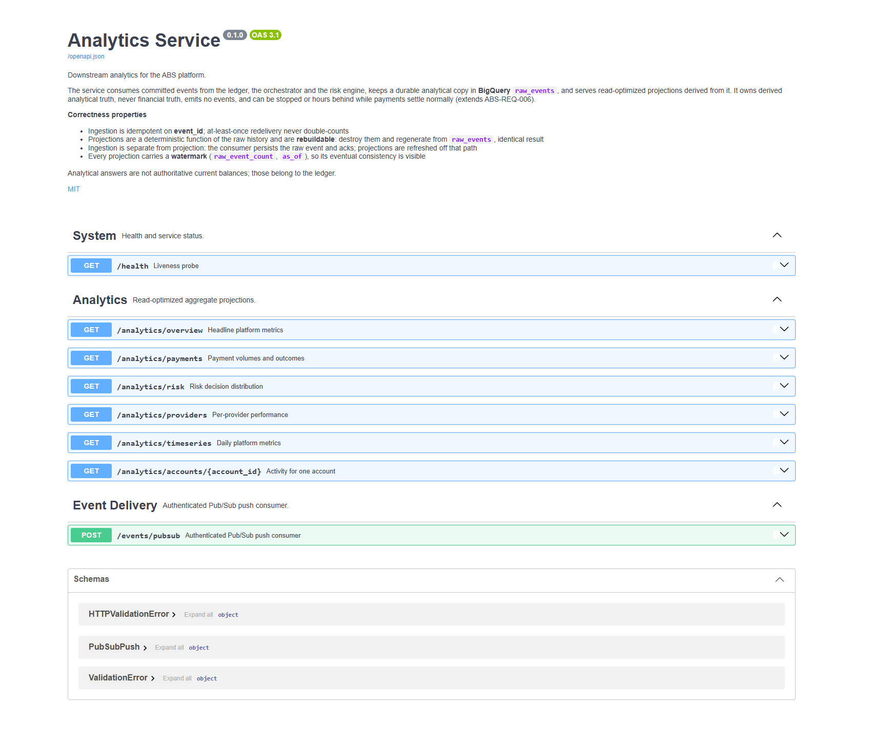

---

## Contents

- [What it does](#what-it-does)
- [Two worlds](#two-worlds)
- [Ingestion and projection are separate](#ingestion-and-projection-are-separate)
- [The rebuild](#the-rebuild)
- [Architecture](#architecture)
- [Verification and evidence](#verification-and-evidence)
- [Running it locally](#running-it-locally)
- [Design decisions](#design-decisions)
- [Project layout](#project-layout)

---

## What it does

The service turns the ecosystem's event history into read-optimized aggregates: payment volumes and settlement rates, the risk decision distribution, provider performance, per-account activity and daily platform metrics. Each is a deterministic projection of the retained events. Here is the live `overview`, built from 152 events across all three streams, with the watermark naming the exact event set it was computed from:

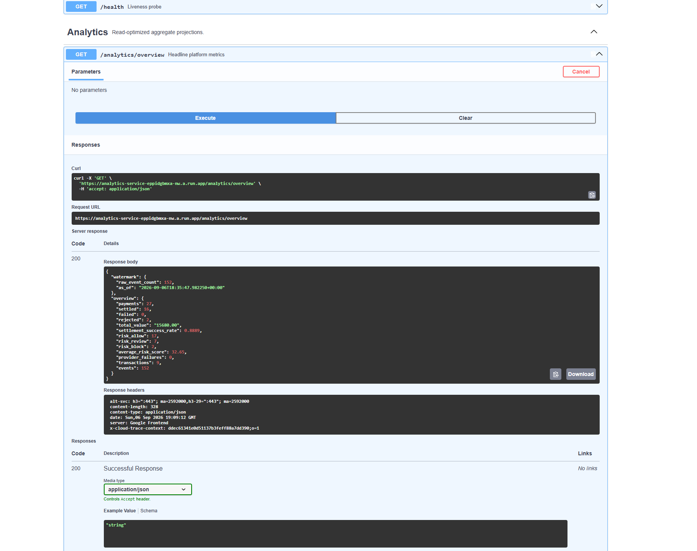

Every response carries that watermark (`raw_event_count`, `as_of`), so the service's eventual consistency is on the wire, not just in the docs. Analytical answers are not authoritative current balances; those belong to the ledger.

---

## Two worlds

Analytics draws a clean line between the transactional platform and the analytical one. It subscribes to all three event topics and has no client for any other service and no publish path.

```
   TRANSACTIONAL WORLD                        ANALYTICAL WORLD

   Ledger ───────────┐
                     │
   Orchestrator ─────┼── Pub/Sub ──▶ analytics-service ──▶ BigQuery raw_events
                     │                                          │
   Risk ─────────────┘                                          ▼
                                                      deterministic projections
```

The transactional services stay authoritative for the facts they commit. Analytics keeps a durable analytical *copy* in `raw_events` and derives everything from it. Its isolation extends ABS-REQ-006: it can be stopped, broken or behind while payments settle normally, proven live, when its ingestion hit errors and lagged, not one payment was affected. All three streams do feed it, the ledger's transaction events alongside the orchestrator's and risk engine's:

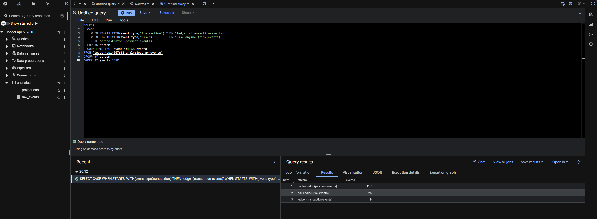

---

## Ingestion and projection are separate

The consumer does one durable, acked thing: append the raw event. Projections are disposable derived state, materialized off that path by a scheduled refresh. A projection failure leaves analytics stale but loses no event, and a rebuild repairs it.

**Ingestion is an append-only streaming insert, not per-event DML.** This is a decision the live deployment forced: a first design used a `MERGE` per event, which broke under load with `Too many DML statements outstanding, limit is 20`, BigQuery caps concurrent DML and is not built for high-frequency single-row writes. So ingestion appends, and the one-per-`event_id` invariant is enforced on read: the refresh reads `raw_events` deduplicated by `event_id`, and `raw_count` counts distinct ids. This is the standard append-then-dedup-on-read analytics pattern, and it matches what the projections already do.

The store keeps its two tables, `raw_events` (the durable history) and `projections` (the materialized read model), in its own BigQuery dataset:

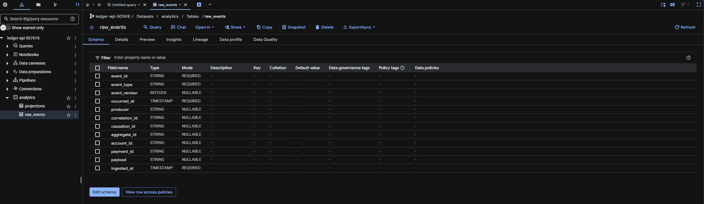

---

## The rebuild

The service's defining property: destroy the entire materialized read model and regenerate it from `raw_events`, and every aggregate comes back identical. The watermark makes the claim exact, the rebuild is compared against the *same* raw-event set, so no event arriving mid-demo can make a correct rebuild look wrong. Demonstrated live:

```
BEFORE     152 events   payments 27 · settled 16 · £15,680 · risk 17/7/2     watermark as_of 18:35:47Z
              │
DESTROY    delete every projection row  →  overview {}  ·  raw_events still 152 (untouched)
              │
REBUILD    refresh job recomputes from raw_events
              │
AFTER      152 events   payments 27 · settled 16 · £15,680 · risk 17/7/2     watermark as_of 18:35:47Z

RESULT: IDENTICAL
```

The materialized projections that get destroyed and regenerated, each stamped with the watermark:

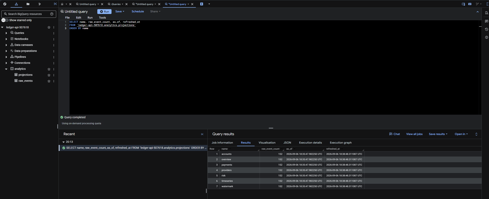

A rebuild is not a routine operation; it is the proof. In normal running a scheduled **refresh** keeps the read model current, run as a Cloud Run Job off the ingest path:

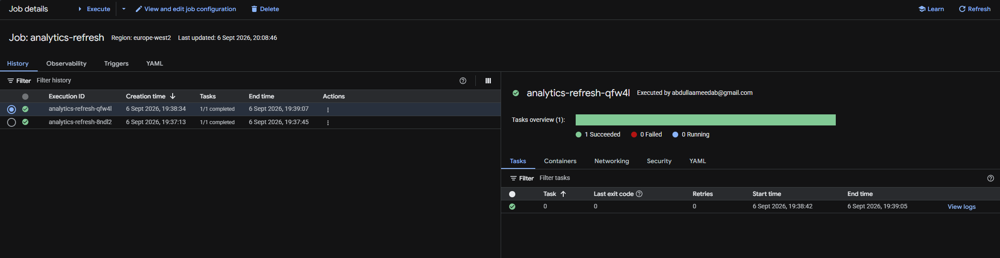

---

## Architecture

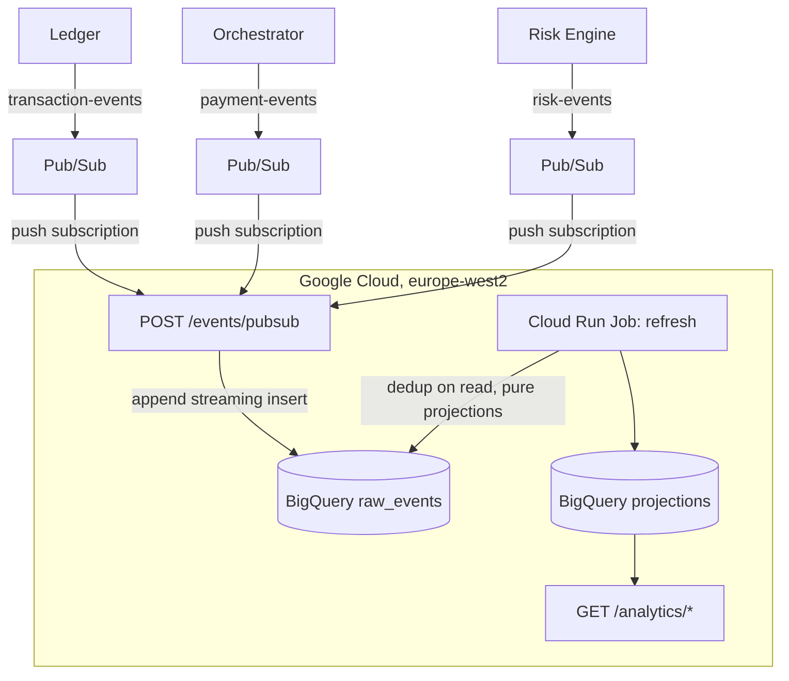

FastAPI and Pydantic handle validation, routing and the OpenAPI spec. The store is BigQuery, reached with the runtime service account's own IAM, no Cloud SQL, no connection string, no secret. The service and the refresh Job run as a dedicated least-privilege runtime identity, scoped to exactly the analytics dataset, not the broad default compute account:

| Cloud Run service | Dedicated runtime identity |
|---|---|
| 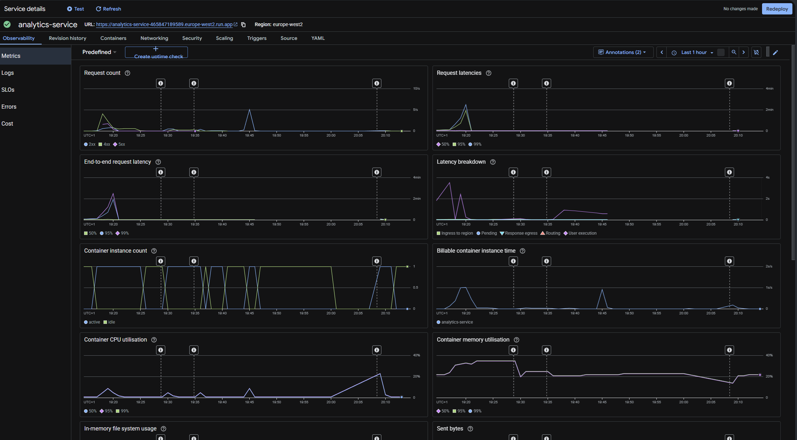 | 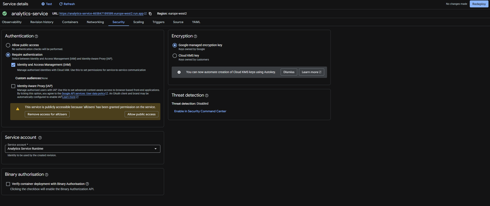 |

**It fans in from all three services.** Three push subscriptions, one on each upstream topic, deliver to the single `/events/pubsub`, which routes on event type and normalizes both ecosystem wire formats (a full envelope in the data, or `event_id`/`event_type` in Pub/Sub attributes with the payload in the data, the ledger's shape).

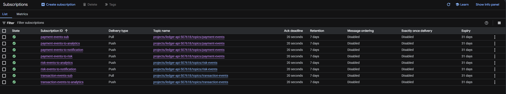

Because the ingest endpoint is the only surface that mutates state, it is authenticated: each subscription attaches a Google OIDC token minted for a dedicated push service account, and the consumer verifies it before applying any event. The read and health endpoints are public by scope decision. An unauthenticated call to ingest is refused:

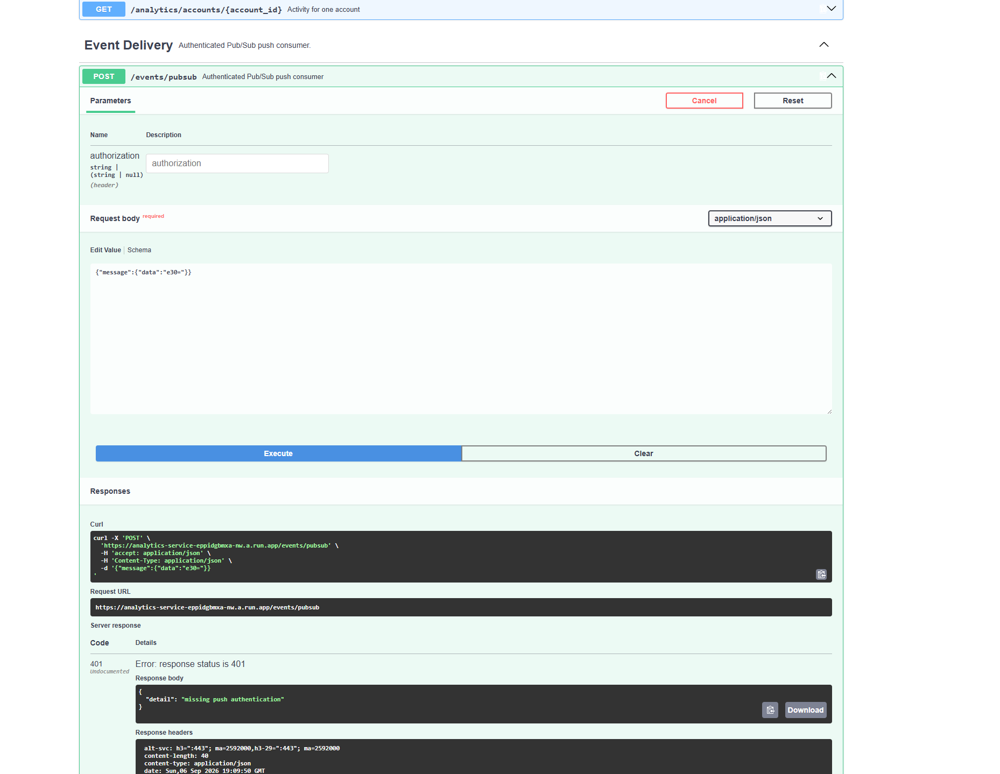

**Deployment is keyless.** GitHub Actions lints, runs the full suite against the in-memory store (no cloud, no database service), and validates the Terraform. On green it builds the image and deploys the service and the refresh Job through **Workload Identity Federation**: GitHub presents a short-lived OIDC token that GCP exchanges to impersonate a repository-scoped deploy account, so no long-lived key is stored in the repository.

| Keyless identity (WIF) | Only this repo can deploy |
|---|---|
| 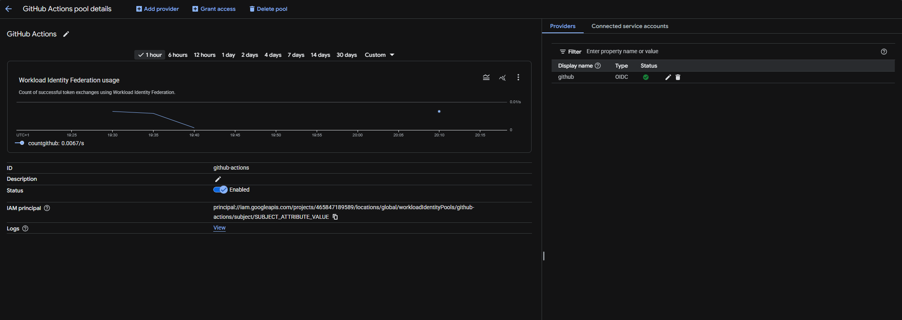 | 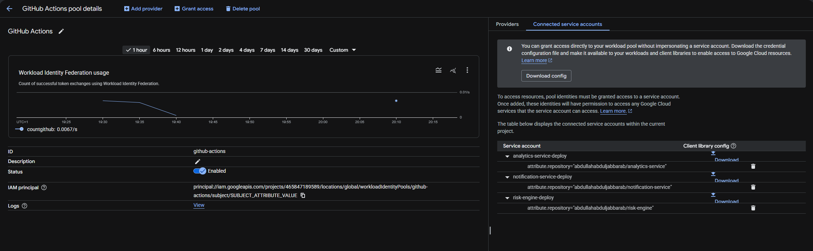 |

---

## Verification and evidence

44 automated tests cover the envelope, the projections, the store contract, the admin commands and the API, and the streaming builder is proven byte-for-byte identical to the reference build. The suite runs in full against the in-memory store in CI, with no cloud, and the BigQuery adapter is smoke-tested against a temporary dataset at deploy. On top of the unit tests the service was proven against its live BigQuery deployment.

**Load test (Locust, live read path, 5 concurrent users, 60 seconds):**

| Metric | Target | Measured |
|--------|--------|----------|
| Requests | | 315 |
| Failures | 0 | 0 |
| Read p50 | < 1000ms | 620ms |
| Read p95 | < 2000ms | 800ms |
| Health p50 | < 100ms | 33ms |
| Throughput | > 5 req/s | 5.29 req/s |

Reads are BigQuery-backed, hence higher latency than the OLTP services, the deliberate OLAP trade-off, with a caching improvement path noted in [`docs/SLO.md`](docs/SLO.md).

**The full loop, live.** All three streams feed `raw_events`; the refresh Job materializes the projections; the read API serves them with a watermark; and the **rebuild reproduces every aggregate byte-for-byte at the same watermark**. One `correlation_id` was seen spanning seven events across the orchestrator and risk engine in the analytical history (ABS-REQ-009).

**Two findings under live load, both corrected to the platform-appropriate pattern:** the BigQuery DML-concurrency limit (fixed with streaming ingestion and dedup on read), and the ledger's distinct wire format (the consumer now normalizes both). Individually valid services, limits found only under real cross-service load, is exactly the evidence this ecosystem is built to produce.

**Requirement to evidence:**

| Requirement | How it is verified |
|-------------|--------------------|
| Isolation from financial state (ABS-REQ-006) | strict sink, no write path, no broker client; live, analytics erroring and lagging never touched a payment |
| Consumers tolerate duplicate delivery (ABS-REQ-008) | `test_same_event_id_twice_contributes_once`, `test_replaying_raw_history_twice_is_identical`; dedup on read |
| One correlation id across services (ABS-REQ-009) | live, one id across seven events over two producers in `raw_events` |
| Deterministic, rebuildable read model | `test_full_rebuild_regenerates_every_projection_identically`, `test_streaming_builder_matches_the_reference_build`; the live rebuild proof |

The full mapping is in [`docs/VV_PLAN.md`](docs/VV_PLAN.md), the load test in [`docs/SLO.md`](docs/SLO.md), the engineering narrative in [`docs/ENGINEERING_REPORT.md`](docs/ENGINEERING_REPORT.md), and the STRIDE threat model in [`docs/THREAT_MODEL.md`](docs/THREAT_MODEL.md).

---

## Running it locally

Requires Python 3.12; no Docker or database needed, the default store is in-memory.

```bash
# 1. install dependencies
pip install -r requirements.txt

# 2. run the service (STORE_BACKEND defaults to "memory")
uvicorn app.main:app --reload
```

Then open http://localhost:8000/docs. Post a Pub/Sub-shaped envelope to `/events/pubsub` (the endpoint is open with `PUBSUB_PUSH_SA` unset), refresh the projections with `python -m app.admin refresh`, and read them from `/analytics/*`. The in-memory store satisfies the same contract as BigQuery, so the whole loop, including the rebuild, runs with no cloud.

**Running the tests** (no cloud, no database):

```bash
pytest
```

The BigQuery adapter's smoke test runs against a temporary dataset when enabled: `RUN_BQ_SMOKE=1 pytest tests/test_bigquery_smoke.py`.

---

## Design decisions

**BigQuery, not another OLTP database.** Analytics is scan-and-aggregate over an append-only history, which is what a columnar warehouse is for; forcing it into a transactional PostgreSQL for symmetry would be backwards. This draws a clean OLTP/OLAP line across the ecosystem.

**raw_events is a durable analytical copy, canonical only within analytics.** "Rebuildable from events" is only defensible if the events are retained, and Pub/Sub retention is finite, so the service keeps its own history and rebuilds from that, never from the broker.

**Ingestion separate from projection; append then dedup on read.** The consumer appends and acks; projections are disposable and refreshed off the path. Streaming ingestion scales where per-event DML did not, and the one-per-event_id invariant is enforced on read.

**Deterministic, materialized projections.** Pure functions of the raw history, materialized as tables the API serves, so a rebuild is exact and unit-testable and a read is a cheap lookup. A watermark makes the rebuild rigorous.

**Keyless deploy, least-privilege runtime.** Workload Identity Federation removes the long-lived key from CI; the service and Job run as a dedicated runtime identity scoped to the analytics dataset.

More decisions and their trade-offs are in [`docs/DECISIONS.md`](docs/DECISIONS.md).

---

## Project layout

```
app/            FastAPI app, envelope, projections + streaming builder, store port, BigQuery adapter, admin commands
terraform/      Analytics infrastructure as code: BigQuery dataset, Cloud Run service and refresh Job, subscriptions, WIF
scripts/        Load test harness
tests/          44 tests: envelope, projections, store contract, admin, API; a BigQuery smoke test at deploy
docs/           Design, requirements, MVP, decisions, engineering report, threat model, security, SLOs, V&V, build log, evidence
```

---
